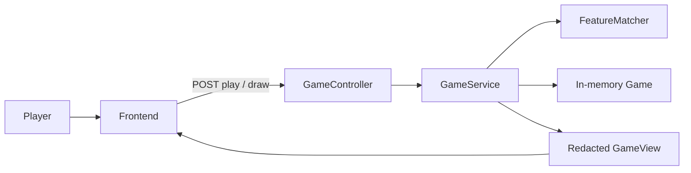

# IPA-UNO MVP Task List

The repo today is a skeleton: Spring Boot 4 on `:8080` with `/api/status` and CORS for Vite, plus an untouched React starter. There is no card model, game state, or play UI yet.

**In scope:** pulmonic consonants only, two copies of each chart symbol, one player who plays or draws, a visible discard top card, a hidden draw pile, backend-authoritative legality.

**Out of scope:** wildcards, vowels, multiplayer, multiple concurrent games / shareable game IDs, hidden-hand redaction across players, UNO-style reverse/skip/+2.

**Defaults (change later if you want):** official IPA pulmonic chart (~59 symbols, 118 cards), deal 7, empty hand wins, player may draw even with a legal play, illegal plays are rejected by the server.

---

## Design to keep wildcards easy later

- Model a card as a **sealed interface** (`Card`) with only `PulmonicConsonant` for now, so a `Wildcard` can be added later without rewriting the deck or API.
- Matching compares a **feature triple** (manner, place, voicing), not “the top card object.” Today that triple comes from the last pulmonic card; a future wildcard can *name* a triple instead.
- Frontend never implements matching. If the view includes `playableCardIds`, the UI can grey out cards without owning the rule.
- **Illegal play errors are descriptive.** The backend formats why a play failed (both cards’ manner/place/voicing in plain English); the frontend shows the API `message` verbatim.

**Single game for MVP.** The server holds one in-memory game at a time (no game IDs, no table lookup). Starting a new game replaces the current one. Later: swap the singleton for a `Map<UUID, Game>`, add `gameId` to the view and URL paths, and let players join via a copied ID.

**Card IDs: `{symbol}#{copyIndex}`.** Each deck instance gets a deterministic string id: IPA symbol + `#` + copy index (`0` or `1`). Examples: `p#0`, `p#1`, `ʃ#0`, `θ#1`. The symbol alone is not unique (two copies per symbol); the suffix distinguishes instances. IDs are assigned when the catalog factory builds the two copies, stay fixed for the life of that card object, and appear in the API view and in `POST /api/game/play` as `{ "cardId": "p#0" }`. Wildcards later can use their own scheme (e.g. `wildcard#0`).

---

## Backend tasks (TDD: test, watch it fail, then implement)

Work under `com.ipauno` in [backend/](backend/). Run `./mvnw test` from `backend/`. Separate small backend-only commits.

### 1. Feature enums and pulmonic card type

- Add enums (not strings): `MannerOfArticulation`, `PlaceOfArticulation`, `Voicing`.
- Add sealed `Card` + record `PulmonicConsonant` (`id`, manner, place, voicing, IPA `symbol`). `id` follows `{symbol}#{copyIndex}` (see above).
- Tests: enum completeness, record equality, two instances with the same symbol but different ids (e.g. `p#0` vs `p#1`) are distinct.

### 2. Pulmonic catalog (two of each)

**Storage: For now, Java, not JSON.** Keep the chart in a dedicated `PulmonicConsonantCatalog.java` that references the feature enums directly (e.g. `entry("p", MANNER_PLOSIVE, PLACE_BILABIAL, VOICED)`). This gives compile-time safety, simpler TDD, and fewer moving parts for ~59 static entries. The frontend does not need the full catalog for MVP — it receives resolved cards from the API. JSON can be reconsidered later if we need a shared reference chart or non-dev editing.

- Encode the official IPA pulmonic chart as a static catalog (not ad-hoc strings). Assign a **single place** to symbols that span columns on the printed chart (alveolar for `t n s l r` etc.; dental for `θ ð`; postalveolar for `ʃ ʒ`; glottal for `ʔ h ɦ`).
- Factory builds **two copies** of each symbol with ids `{symbol}#0` and `{symbol}#1`.
- Tests: every chart symbol present, no impossible/empty cells, exactly two copies per symbol, unique ids, feature triples match the chart.

### 3. Feature matching (the UNO rule)

- `FeatureMatcher.isLegal(played, target)`: true iff at least two of manner / place / voicing match.
- Add human-readable **feature labels** on the enums (or a small formatter) so descriptions read naturally: `VOICELESS` → “voiceless”, `TAP_OR_FLAP` → “tap or flap”, `PLOSIVE` → “plosive”, etc.
- Add `FeatureMatcher.describe(PulmonicConsonant)` → e.g. `"b is a voiced bilabial plosive"`, and `explainIllegalPlay(played, target)` → e.g. `"b is a voiced bilabial plosive while t is a voiceless alveolar plosive"`. Optionally append which features matched (e.g. `"Only manner matches; you need at least 2 of 3."`).
- Tests: 3/3, 2/3 legal; 1/3 and 0/3 illegal; identical copies legal; `explainIllegalPlay` output for a known pair (e.g. b vs t). Leave a comment/TODO that a wildcard should short-circuit this later.

### 4. Deck, deal, and in-memory game

- Shuffle the 118-card deck, deal 7 to the player, flip one non-empty discard starter, rest is the draw pile.
- In-memory `Game`: hand, draw pile, discard pile, status (`IN_PROGRESS` / `WON`). `GameService` holds a single optional/current game (not a map).
- Tests: deck size, hand size 7, one starter on discard, remaining draw count, shuffled (not catalog order).

### 5. Play and draw mutations

- **Play:** card must be in hand and legal vs current feature triple; move it to discard; if hand is empty, `WON`.
- **Draw:** take the top of the draw pile into the hand. If the draw pile is empty, reshuffle the discard **except the top card**.
- Reject unknown cards, cards not in hand, and illegal matches; state must not change. Illegal **feature** mismatches use `FeatureMatcher.explainIllegalPlay` for the error text.
- Tests for each of those paths, including win, reshuffle, and descriptive illegal-play messages.

### 6. Redacted game view (even for one player)

- DTO: `status`, `topCard` (full features + symbol), `hand`, `drawPileCount`, `playableCardIds`. Omit `gameId` for MVP; add it when multi-game support lands.
- Never include the draw pile contents or buried discard cards (same view shape will extend to multiplayer later).
- Tests: view hides piles, `playableCardIds` matches the matcher, won games have an empty hand.

### 7. REST API (singleton game)

Implement this task as the following small, backend-only commits. Use MockMvc tests from `org.springframework.boot.webmvc.test.autoconfigure` (already used by [StatusControllerTest.java](backend/src/test/java/com/ipauno/api/StatusControllerTest.java)). `GameService` continues to store one game instance, and CORS already allows GET/POST from `http://localhost:5173`.

#### 7.1 Start a new game

- `POST /api/newGame` starts the singleton game, or replaces the current game if one exists, and returns the redacted view.
- Add the controller/API scaffolding and MockMvc tests for the response status and view shape.

#### 7.2 Get the current game

- `GET /api/game` returns the current redacted view.
- Return 404 with a JSON `message` if no game has been started; test both paths.

#### 7.3 Draw a card

- `POST /api/game/draw` draws one card and returns the updated redacted view.
- Return 404 with a JSON `message` if no game has been started; test both paths.

#### 7.4 Play a card — happy path

- `POST /api/game/play` accepts `{ "cardId": "..." }` and returns 200 with the updated redacted view when the play succeeds.
- Test that the played card leaves the hand and becomes the top discard card. Keep error-path assertions for the next commit.

#### 7.5 Play a card — error paths

- Return 400 with a JSON `message` for an unknown card id, a card not in the hand, an illegal feature match, or a malformed/missing request body; failed requests must leave game state unchanged.
- For an illegal feature match, return the descriptive message built by the backend, e.g. `{ "message": "b is a voiced bilabial plosive while t is a voiceless alveolar plosive. Only manner matches; you need at least 2 of 3." }`. Include a test that the message names both cards’ features.
- Return 404 with a JSON `message` if no game has been started.

---

## Frontend tasks (after the API works)

Work in [frontend/](frontend/). Presentation only. **One interaction per task** — separate frontend-only commits. Browser-verify each step before moving on.

### 8. API foundation (types + proxy)

- Mirror the game-view JSON in TypeScript (enums as string unions matching Jackson’s enum names).
- Add a Vite proxy to `http://localhost:8080` in [vite.config.ts](frontend/vite.config.ts).
- Minimal fetch helpers: `startGame()` → `POST /api/newGame`, `getGame()` → `GET /api/game` (play/draw helpers added in later tasks).
- Replace the Vite starter shell in [App.tsx](frontend/src/App.tsx); no game UI yet beyond proving the client can talk to the backend.

### 9. Static game display (load only, no interactions)

Focus on **HTML/CSS layout** — get the board looking right before wiring clicks.

- On mount: call `POST /api/newGame`, store the returned view in React state.
- `CardView`: rounded rectangle, IPA glyph (font stack with IPA coverage, e.g. Noto Sans).
- Board layout: one **discard slot** showing `topCard`; **hand** as a row of cards; **draw pile** as a count label only (hidden pile — no card backs).
- Cards are not clickable; no draw button yet. Optionally grey out non-`playableCardIds` visually (purely cosmetic).
- Browser-verify: game loads, 7 cards in hand, one card on discard, draw count visible.

### 10. Draw card

- Add a **Draw** button; on click call `POST /api/game/draw`, replace state with the response body.
- Browser-verify: hand grows by one, draw count decreases.

### 11. Play card (legal)

- Make hand cards **clickable**; on click call `POST /api/game/play` with `{ cardId }`.
- On **200**, replace state with the returned view (played card leaves hand, discard updates).
- Browser-verify: play a card from `playableCardIds` and confirm the board updates.

### 12. Play card (illegal)

- On **400**, read `message` from the response and show it in the UI (descriptive text from the backend, e.g. why b cannot follow t).
- Do **not** update hand/board state from a failed response; clear the error on the next successful draw or legal play.
- Browser-verify: click a non-playable card (or one that fails matching) and confirm the message appears with game state unchanged.

### 13. Won status

- When `status === 'WON'`, show a clear **You won** (or similar) message.
- Disable or hide play/draw controls once the game is won. Optional **New game** button calling `POST /api/newGame` again.
- Browser-verify: reach an empty hand (or temporarily force `WON` in dev) and confirm the win UI appears.

---

## Suggested order

Backend 1 → 3 can proceed without HTTP. Backend 4 → 7 is the playable loop; task 7 is split into one endpoint-sized commit at a time, with play's success and failure behavior separate. Frontend 8 → 13 adds one layer at a time: types/proxy → static display → draw → legal play → illegal play → win.

| Task                | Layer    | Why this order                      |
| ------------------- | -------- | ----------------------------------- |
| 1 Enums + `Card`    | backend  | Foundation; wildcard-ready type     |
| 2 Catalog ×2        | backend  | Real deck data                      |
| 3 Matcher           | backend  | The only rule for MVP               |
| 4 Deal / `Game`     | backend  | State container                     |
| 5 Play / draw       | backend  | Mutations + win / reshuffle         |
| 6 Redacted view     | backend  | Client contract                     |
| 7.1 New game API    | backend  | Create/replace the singleton game   |
| 7.2 Get game API    | backend  | Read the current redacted view      |
| 7.3 Draw API        | backend  | First HTTP mutation                 |
| 7.4 Play success    | backend  | Core API happy path                 |
| 7.5 Play errors     | backend  | Validation, messages, unchanged state |
| 8 API types + proxy | frontend | Minimal client before UI            |
| 9 Static display    | frontend | Layout/CSS without interaction risk |
| 10 Draw             | frontend | First mutation                      |
| 11 Play (legal)     | frontend | Core happy path                     |
| 12 Play (illegal)   | frontend | Error path                          |
| 13 Won              | frontend | End state                           |
